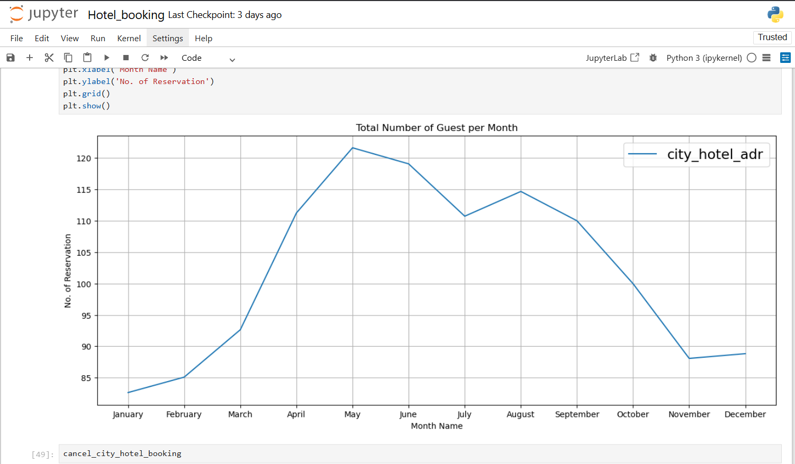

# Hotel Booking Data Analysis

## Overview
This project focuses on analyzing hotel booking data to uncover customer behavior, booking trends, reservation patterns, and hotel business insights using Python.

The analysis includes:
- Monthly booking trends
- Average Daily Rate (ADR) analysis
- Market segment analysis
- Customer type analysis
- Room reservation trends
- Repeated guest percentage

---

## Tools & Technologies Used
- Python
- Pandas
- NumPy
- Matplotlib
- Seaborn
- Jupyter Notebook

---

## Dataset
The dataset contains hotel booking information including:
- Reservation status
- Customer types
- Market segments
- Room types
- ADR (Average Daily Rate)
- Booking dates
- Guest information

Dataset File:
```txt
hotel_booking.csv
```

---

# Project Visualizations

## Monthly Booking Trends


---

## Average Daily Rate (ADR) Analysis


---

## Market Segment Distribution


---

## Most Reserved Room Types


---

## Customer Type Analysis


---

## Key Insights
- Certain months show significantly higher hotel bookings, indicating seasonal demand.
- Online travel agencies contributed a major portion of bookings.
- Repeated guests represented a smaller percentage compared to new customers.
- Some room types were consistently preferred over others.
- ADR varied across customer categories and booking periods.


## Requirements

```txt
pandas
numpy
matplotlib
seaborn
jupyter
```

---

## Conclusion
This project demonstrates practical data analysis and visualization skills using real-world hotel booking data. It highlights the use of exploratory data analysis (EDA) techniques to extract meaningful business insights and trends.
